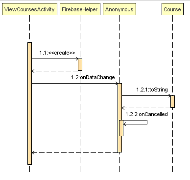
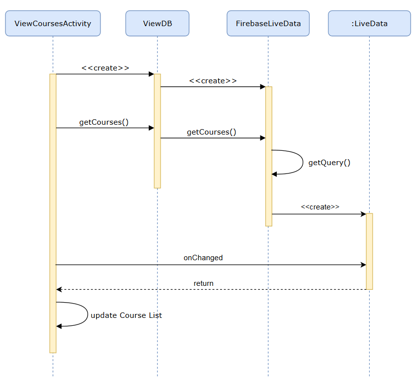

# COMP6901 - Project 
Team Members:
* Lurlynn Maharaj
* Nikita Louison
* Richard Samuel
* Amar Andrew Singh

## Introduction

The purpose of this project is to investigate the designs done within the code and discover whether or not any design patterns were in violation. The design patterns examined were based on the SOLID principles and once realized, Object-Oriented design patterns were used to resolve the violations/issues. The application chosen for refactoring is called the Attendance Application. This app was originally built by; Shiva Ramoudith and Jevon Alexis. All programs were written in java and built in Android Studio. The purpose of the app is to record courses, lectures and student attendances to these lectures. It also provides analytics by display charts with data based on total attendance and tardiness.

## Component One - ViewIndividualStudentAnalytics class
### Issues
#### Functionality
Given the word “analytics”, this java class is based on the computational analysis of data and statistics related to students such as attendance and punctuality. To be more precise, the class retrieves the stored data in the Firebase Database including as student name, student ID, lecture name, starting time of lecture, recorded attendance date of student and the time of student arrival. 
This class displays the data in the form of pie-charts for a selected student.
The class uses the following to calculate punctuality and attendance of each student.
* The student ID
* Course code
* The retrieved number of minutes late to the lecture
* Marking of attendance
To plot the charts, a count is kept for students who arrive early and late sessions as well as whether or not sessions were attended. Once the values are allocated, the two charts are updated with the respective data. In the ViewIndividualStudentAnalytics class both methods (drawAttendancePieChart and drawPunctualityPieChart) are used to analyze data.
#### Strengths
1. All code pertaining to Individual Student Analytics are in one class and the chart drawing are in their relevant methods for analysis. 
2. The relevant calculation methods for student analysis such as attendance and punctuality are also in this one class.
#### Weaknesses
1. The class has too many methods and as such readability and understandability is challenging and there is low cohesion.
2. The class generates a great variety of actions, it is broad and unfocused. 
   1. For example: gathering data, calculating, drawing charts and updating charts.
3. The draw pie chart methods are not “open” for use in the other classes. If new charts types have to be added or re-used they have to be re-written or “duplicated”. 
   1. For instance: if piecharts were needed for another analytics class, it would have to be redrawn for that specific class.
4. If any other chart type (e.g. Line Chart) became an additional requirement, then it would increase the amount of methods in this one class.

#### Why SRP & OCP 
##### SRP is being broken.
1. Single Responsibility Principle: Every software module/ class, should have only one reason to change or responsibility.
2. If a class has more than one responsibility, then the responsibilities become coupled. In this case the calculations are tightly coupled to creating/updating charts.
3. Changes to one responsibility may impair or inhibit the class’ ability to meet the others.
4. This kind of coupling leads to fragile designs that break in unexpected ways when changed.  It may also lead to “code-rot”.

Please note the UML depicting the original Class UML layout of this class as well as the sequence UML diagram depicting the calculation methods. The UML class diagram depicts the abundance of methods in the class and the sequence diagrams depicts the coupling of the methods.
##### OCP is being broken.
1. Open Close Principle: Software entities should be open for extension but closed for modifications.
2. Developers should design modules that never change. When requirements change or in this case any addition charts are required, you extend the behavior of such modules by adding new code, not by changing old code that already works. 
3. This means that the behavior of the module can be extended. We can then make the module behave in new and different ways as the requirements of the application change, or to meet the needs of new applications.

Please note the UML depicting the sequence UML diagram depicting the drawing piechart methods located in this class.

#### UML Diagrams
##### Class Diagram

##### Sequence Diagram

### Proposed Solution
#### Design Patterns
##### Creational Pattern: Factory Subsystem: & Structural Pattern: Facade Subsystem
ViewIndividualStudentAnalytics had tight coupling because there is the responsibility of drawing the pie charts, calculating the attendance and punctuality of students and populating the charts with the data. The previous design violated the SRP and OCP. 

The ViewIndividualStudentAnalytics class had three responsibilities. 
1. The first responsibility is to provide drawing of the pie chart. 
2. The second responsibility is to calculate attendance and punctuality 
3. The third is to update the pie charts. 

If we add a new type of graph or new calculation then we will have to retest every method in the class to ensure that the other charts are working i.e. rebuild, retest, and redeploy ViewIndividualStudentAnalytics. 

A better design is to separate the responsibilities. As mentioned before, a façade and factory design are used. 

##### Factory Pattern
A creational pattern that creates objects without exposing the instantiation logic to the client.
Its intent is to define an interface for creating an object, and lets the subclasses decide which class to instantiate. Factory method lets a class defer instantiation to subclasses.

Implemented Factory Subsystem:
* Factory class called:- Statistics
  - This class is the Factory to generate object of concrete class based on given information. The concrete/subclasses classes here are attendance and punctuality.
* Interface class:- Calculation
  - This class is the interface between Statistics and the concrete/subclasses Attendance and Punctuality.
* Utility Classes:- Attendance & Punctuality
  - These classes are implementing the necessary calculations pertaining to its corresponding names. They implement the Calculations interface.

##### Facade Pattern
Is a structural pattern that has single class to represent an entire subsystem.
Its intent is to provide a unified interface to a set of interfaces in a subsystem. The facade is the higher level interface that makes the subsystem easier to use and reference. In essence it wraps a complicated subsystem with a simpler interface.
The facade object is to be a facilitator or advocate or facilitator. It promotes decoupling the subsystem from its potential many clients. (NB: ViewCourseAnalystics’ s Line chart)

Implemented Facade Subsystem:
* Facade class called:- ChartRendering
  - This class calls the subclass Pie to draw a Pie Chart. Statistics are then calculated and fed into the charts. Thereafter, labels and descriptions are added pertaining to the type of data the chart is illustrating. 
* Interface class:- Chart
  - This class is the interface between the ChartRendering and subclass Pie.
* Utility Classes:- Pie
  - This class implements the Chart interface. It draws a Pie chart and returns and Pie Chart object. 

#### The advantages of the new design
* More cohesion
* Easier to read code
* Removes tight coupling
* Charts open for extension for instance to the line charts in the View Course Analytics class
* Able to add new chart types required by clients for instance bar charts
* New calculation subsystem of “utility” classes can be added for further statistical analysis of courses, lectures and students

#### How it facilitates any of SOLID principles discussed
1. Follows these principles:
   * SRP & OCP
2. Creational Pattern: Factory:
   * To solve the SRP issue, the factory includes an Interface Calculations and an Attendance and Punctuality class which implements the interface. The factory solution now utilizes a class called Statistics which uses the Attendance and Punctuality class to execute calculations for early and late students as well as total attendances. With this solution, the responsibility of the calculations belong to the Statistics class and if another calculation was to be added it can now be created as a new class which implements the Calculations interface. 

3. Structural  Pattern: Facade
   * To solve the OCP issue, a façade solution was used. An interface called Chart is created along with a Pie and Line class that implement the interface. The façade solution uses a class called ChartRendering which uses the Pie class to create pie charts in methods. These methods create pie charts for attendance and punctuality. If another chart was to be used to show another type of data, for example a line chart for the ViewCourseAnalytics class, it could be added to the this class. 

#### UML Diagram
##### Class Diagram

##### Sequence Diagram

## Component Two - ViewCourseActivity Class
### Issues
#### Functionality
This activity display a list of the courses using the FirebaseHelper class which interacts with the database. Firebase is a NoSQL Database and the courses are stored in a tree format under each lecturer’s ID. 
#### Strengths
1. ViewcourseActivity has the functions needed to provide the required course ID and course name, which is retreives from the Firebase Database.
3. Firebase provides a visible “identifiable” reference for each method that needs it in the mentioned class.  
#### Weaknesses
1. Firebase and a lot of its dependencies are required for the class to run..
2. A new ValueEventListener object is required to get the Firebase Data.
3. FirebaseHelper deal with Firebase commands making it difficult to untangle.
4. Firebase is tightly coupled with this class.
#### SRP
1. Since this class is so tied together it makes it difficult to make any major changes such as a new Database.
2. FirebaseHelper should only deal with firebase commands, however ViewCourseActivity has firebase depencies
#### UML Diagrams
##### Class Diagram

##### Sequence  Diagram

### Proposed Solution
The primary issue of the original implementation is that Firebase is in all the classes that are linked to ViewCourseActivity. The proposed method will take firebase completely out of ViewCourseActivity and house it in a separate entity. While FirebaseHelper tried to do that it still needed to use a ValueEventListener which is part of Firebase. To separate that out ViewCourseActivity will now observe a ViewModel Class that will actually called the Firebase commands. This way ViewCourseActivity does not end up using any Firebase references and will only receive a list of Courses.

#### Design Patterns
##### Observer
Observer pattern is used due to how Firebase retrieves Data. Firebase requires a ValueEventListener to get data in real time and update any necessary components. The ViewCourseActivity will observe the ViewCourse Class for any changes and update the course list with any changes.
##### MVC Pattern 
A loose implementation of the Model View Controller Pattern was used:
1. FirebaseLiveData (Model) - This will contain the database interaction with Firebase and parse the data in a way that other classes can use it without having any references to Firebase.
2. ViewCourseActivity (View) - This will just be displaying the information from the database by observing the ViewClass (Controller).
3. ViewCourse (Controller) - This will handle the interaction between the FirebaseLiveData and ViewCourseActivity. It instantiates a FirebaseLiveData and returns the information in the form of a list of Courses. 

#### The advantages of the new design
1. MVC naturally tends to end to Abstract code into reusable modules and with the design principles chosen it leads to each component being independent and have a unique function.
2. Firebase is not referenced all over the classes
3. The Database calls and commands only exist in one class and the other classes that interact do not require it.
4. If a change to the database type is required a new database class can be written and only the controller will need updating.
5. Utilises the same underlying classes that were developed by the original developers such as Courses to return the data in a format the application understands.

#### How it facilitates any of SOLID principles discussed
1. Solid Responsibility Principle - Each component has a unique function:
2. FirebaseLiveData - Returns firebase information in useable format.
3. ViewCourse - Gets the information from FirebaseLiveData and sends it to ViewCourseActivitiy.
4. ViewCourseActivity - Only responsible for displaying of Data and observing ViewCourse.

#### UML Diagrams
##### Class Diagram

##### Sequence  Diagram

## Component Three - TimeHelper & ViewCourseAnalytics Class
### Issues
#### Functionality
##### TimeHelper class
This Helper class that provides some useful time related functions. Such as formatting time, getting a time-stamp used in student punctuality; acquiring current hour, minute and day information. It also has the ability to retrieve military time when required. The methods available in the helper class are as follows:
formatTime - This method formats 24hr time into am/pm (12 hour).
* getIDTimeStamp - This method generates an ID for the session using the time and date when a session is plan to start.
* getCurrentHour - This method generates the current hour of the day.
* getCurrentMinute - This method generates the current minute of the day.
* getCurrDay - This method generates the current day of the week.
* getMilitaryTime - This method generates the military time.
##### ViewCourseAnalytics Class
This java class is based on the computational analysis of data and statistics of a course. The calculations are based on the number of students enrolled in a course and the number of students that arrived late for a session of the course. The program itself sets up the line chart and populates it by creating data points or entries on the line based on the statistical data computed. Within the class, the line charts are used to analyze data. It also utilizes a few date methods in the class for formatting and retrieving the current correct date/time.
#### Strengths
1. Functional Code pertaining to Time in the TimeHelper class creating a short-cut class for other classes to call.
2. All code pertaining to Course Analytics are in one class and the chart drawing are in their relevant classes for analysis.
#### Weaknesses
1. The issue is the ViewCourseAnalytics class using its own date/time methods instead of correctly referencing the helper class.
2. ViewCourseAnalytics class is tightly couple with the date/time methods along with other methods in that class.
3. TimeHelper class is not referenced correctly in the ViewCourseAnalytics class as well as other classes as well such as FirebaseHelper, Lecture, IdCheckService and AddLecturesActivity classes.

#### Why OCP
1. There is a failure in the attempt to implement the OCP. For the ViewCourseAnalytics class, it uses its own time related methods when a “Timehelper” class exists.
2. Modules should be open for extension but closed for modifications.
3. Developers should design modules that never require to change. In the case where software requirements needs to be changed, for instance, like adding a new time zone, developers should be able to extend the behaviour of such modules by adding new code, not by changing old code that already works. 
4. This suggest that the behaviour of the module can be extended. The module can then be able to behave in new and different ways as the requirements of the software change.
5. See UML class diagram depicting current layout of Time helper class not connecting to the ViewCourseAnalytics class.

#### UML Diagrams
##### Class Diagram

##### Sequence  Diagram

### Proposed Solution
The main problem in relation to the original implementation is that within ViewCourseAnalytics class it has its own time/date methods that works the other methods within that class which incorporates tight coupling. However, the TimeHelper class already performing time/date related methods to other classes but not referencing TimeHelper correctly. In order to address the issues, the time/date related methods are removed and implemented in the TimeHelper class as well as correctly implementing the TimeHelper methods to other classes such as FirebaseHelper, Lecture, IdCheckService and AddLecturesActivity classes.

#### Design Patterns
1. Adapter
   -Adapter pattern was utilized in TimeHelper because of the frequent uses of TimeHelper class in ViewCourseAnalytics and other classes throughout the application. This will allow proper implementation to other classes to effectively use the methods in TImeHelper. There will also be the option to extend in the near future where applicable.

#### The advantages of the new design
1. Less clutter in the utility classes.
2. TimeHelper used to full advantage and efficiently utilizing its methods to the other classes.
3. The TimeHelper would  be open to extension and no need for modification would be necessary.

#### How it facilitates any of SOLID principles discussed
The Open Closed Principle - In the TimeHelper, it will be closed for modification but open for extension. More methods can be added with regards to time/date, for instance, from the ViewCourseAnalystics class, there were tight coupling with some of the methods. As such, the time/date related methods were removed and was implemented in TimeHelper. The ViewCourseAnalystics would be able to utilize the methods directly from TimeHelper efficiently.

In addition, other extension can be made to TimeHelper, for example, adding a new time format or time zone to the TimeHelper class. This will be able to reference other classes throughout the application if a new feature is to be added later.

#### UML Diagrams
##### Class Diagram

##### Sequence  Diagram

## Design & Implementation Lessons
### Lurlynn
1. Design Pattern – I have been coding for some time, however, I was never exposed to the concept of design patterns. This was a new topic for me and took much time to understand the theory behind it. Though this was a challenge, applying the principles programmatically assisted with a better understanding of the use of the patterns and more importantly the purpose that they serve. Lesson learned is that when writing code, question if that is the only way the code can be written.
2. GitHub – Much of the functionality of github was new to me. I merely used this for viewing code within other programs. This was also the first I have pushed and pulled work. Lesson learned is that this tool can be used in a variety of ways and can make other project work for efficient.
3. Android Studio – definitely a new technology and learning experience. The actual set up of the software is what stood out. Lesson learned is that documentation of the steps taken to set this up is very important. It will assist with future designs and implementations. Additionally, it is important to explore the capabilities of application development software before beginning any major work. 

### Nikita
1. Android Studio.-While I have used Android Studio before, using it at this level was definitely a new experience. Installing and using addons to make the user experience more smooth was interesting. 
2. Github:- I have never used Github before in this capacity particularly its integration with Android studio. Implementing and utilizing the version control features including creating branches, pushing, pulling, committing changes was interesting.
3. Design Patterns and how to implement them:- this project has increased my understanding on design patterns. Having to actively spot the failings and envision improvements based on the principles was enlightening.

### Richard
1. Github - I had used GitHub previously in my final year project in undergrad but   only using the desktop version of it. However, I have never used it with Android Studio integration as version control to commit and push and pull changes. I was unaware of merging branches together into one. It was a learning experience utilizing GitHub to this extent.
2. Using Android Studio - I used Android Studio before but not to this extent where GitHub was used and other plugins which I got to learn to use which was a great experience.
3. The utilization of design patterns - Implementing a design pattern was a new experience for me as I was able to learn and identify which one is best to apply to the TimeHelper Class.

### Andrew
1. Github - While I used github for my Cloud Course seeing it integrated with Android Studio was a learning experience especially when having to merge branches and create a .git to not upload certain files.
2. Firebase Authentication - Had to set this up from scratch as it did not work originally in the application. The sign on page was rebuilt using new code online so that login can even be done. Additionally, things like adding Authentication keys for every android studio for the group was also something I did not know how to setup.
3. Firebase - Firebase is my first NoSQL database experience so I did not have any clue as to how it worked. Even simple things like understanding how to get information from the database and in a working format.
4. Deserializers - This was an inner class that was written to translate a Firebase DataSnapShot into a list of courses. 
5. Observers - Android has a ViewModel class that works as an observer and this was something to consider in future implementations of code. 
6. Android Lifecycle - A big part of android as I have learned is the lifecycle of an Activity. This was a brand new concept and required understanding how they worked and how they transfer between one another.
7. Design Patterns - While looking for possible design patterns for the solution I came across several different ways to do it and the most interesting one was the Observer pattern. I took this idea and expanded it to incorporate the MVC approach as this is one of my favorite design patterns. Design patterns do not have to be so rigid as one is being chosen but a combination of them can be used to achieve the desired goal.

## Limitations & Future Work
 
### Limit
1. Problem Selection - Because there was a small number of classes, there was not a lot of issues that could be identified. In some cases many classes had very similar problems thus creating an overlap and reducing the number of unique problems available for selection.
2. Project Selection - While freedom was given to choose a project it was not always easy to source the full project code. Even looking back at old projects written in school some of them did not run or some code was missing.
3. Database Selection - With the utilization of a cloud-based database (Firebase Console), it was easy to implement. However, Firebase online database is not a completely free platform and has a limit to how much data can be stored. If the storage of the database exceed the free limit then a fee would be charged to continue using Firebase as a database storage for the application.
 
### Future Work
1. Reworking the ViewCourseAnalytics class to utilize the SRP and OCP principle. The issues present in the ViewIndividualStudentAnalytics class is also present in this class. However, time and similarity/duplication of issues influenced our avoidance to implement the solution.
2. ViewCourseAnalytics can in future utilize the facade (ChartRendering) to draw the Line Chart implemented within the class.
3. ViewCourseAnalytics can also utilize the factory (Statistics) to calculate the late attendances for the population of the Line Chart. 
4. Firebase is referenced throughout many classes in the application and the implementation of problem 2 shows how it can be isolated. This will allow easy database changes to be done without breaking the entire application.
5. A Util class was used to store certain values but it could be inserted into the Strings Table which is where Android normally default static values.
6. TimeHelper Utilization could be expanded further as it is under-utilized for its purpose.
7. An overall clean up of the entire software code should be done as there are many import utilities that were not used in many classes.
8. Another database could be implemented other than a free version of Firebase which only have limited storage.

## References
1. Original Implementation of Application: https://github.com/princeandrew01/OldAttendanceApp
2. Design Patterns: https://www.tutorialspoint.com/design_pattern/index.htm
