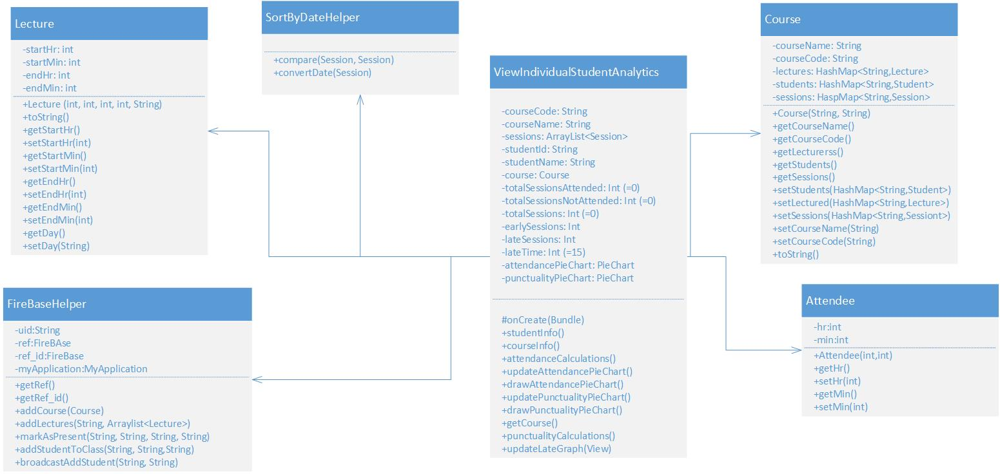

# COMP6901 - Project 
Team Members:
* Lurlynn Maharaj
* Nikita Louison
* Richard Samuel
* Amar Andrew Singh

## Component One - ViewIndividualStudentAnalytics class
### Issues
#### Functionality
Given the word “analytics”, this java class is based on the computational analysis of data and statistics related to students such as attendance and punctuality. To be more precise, the class retrieves the stored data in the Firebase Database including as student name, student ID, lecture name, starting time of lecture, recorded attendance date of student and the time of student arrival. 
This class displays the data in the form of pie-charts for a selected student.
The class uses the following to calculate punctuality and attendance of each student.
* The student ID
* Course code
* The retrieved number of minutes late to the lecture
* Marking of attendance
To plot the charts, a count is kept for students who arrive early and late sessions as well as whether or not sessions were attended. Once the values are allocated, the two charts are updated with the respective data. In the ViewIndividualStudentAnalytics class both methods (drawAttendancePieChart and drawPunctualityPieChart) are used to analyze data.
#### Strengths
1. All code pertaining to Individual Student Analytics are in one class and the chart drawing are in their relevant methods for analysis. 
2. The relevant calculation methods for student analysis such as attendance and punctuality are also in this one class.
#### Weaknesses
1. The class has too many methods and as such readability and understandability is challenging and there is low cohesion.
2. The class generates a great variety of actions, it is broad and unfocused. 
   1. For example: gathering data, calculating, drawing charts and updating charts.
3. The draw pie chart methods are not “open” for use in the other classes. If new charts types have to be added or re-used they have to be re-written or “duplicated”. 
   1. For instance: if piecharts were needed for another analytics class, it would have to be redrawn for that specific class.
4. If any other chart type (e.g. Line Chart) became an additional requirement, then it would increase the amount of methods in this one class.

#### Why SRP & OCP 
##### SRP is being broken.
1. Single Responsibility Principle: Every software module/ class, should have only one reason to change or responsibility.
2. If a class has more than one responsibility, then the responsibilities become coupled. In this case the calculations are tightly coupled to creating/updating charts.
3. Changes to one responsibility may impair or inhibit the class’ ability to meet the others.
4. This kind of coupling leads to fragile designs that break in unexpected ways when changed.  It may also lead to “code-rot”.

Please note the UML depicting the original Class UML layout of this class as well as the sequence UML diagram depicting the calculation methods. The UML class diagram depicts the abundance of methods in the class and the sequence diagrams depicts the coupling of the methods.
##### OCP is being broken.
1. Open Close Principle: Software entities should be open for extension but closed for modifications.
2. Developers should design modules that never change. When requirements change or in this case any addition charts are required, you extend the behavior of such modules by adding new code, not by changing old code that already works. 
3. This means that the behavior of the module can be extended. We can then make the module behave in new and different ways as the requirements of the application change, or to meet the needs of new applications.

Please note the UML depicting the sequence UML diagram depicting the drawing piechart methods located in this class.

#### UML Diagrams
##### Class Diagram

##### Sequence Diagram

### Proposed Changes
#### Design Patterns
##### Creational Pattern: Factory Subsystem: & Structural Pattern: Facade Subsystem
ViewIndividualStudentAnalytics had tight coupling because there is the responsibility of drawing the pie charts, calculating the attendance and punctuality of students and populating the charts with the data. The previous design violated the SRP and OCP. 

The ViewIndividualStudentAnalytics class had three responsibilities. 
1. The first responsibility is to provide drawing of the pie chart. 
2. The second responsibility is to calculate attendance and punctuality 
3. The third is to update the pie charts. 

If we add a new type of graph or new calculation then we will have to retest every method in the class to ensure that the other charts are working i.e. rebuild, retest, and redeploy ViewIndividualStudentAnalytics. 

A better design is to separate the responsibilities. As mentioned before, a façade and factory design are used. 

##### Factory Pattern
A creational pattern that creates objects without exposing the instantiation logic to the client.
Its intent is to define an interface for creating an object, and lets the subclasses decide which class to instantiate. Factory method lets a class defer instantiation to subclasses.

Implemented Factory Subsystem:
* Factory class called:- Statistics
  - This class is the Factory to generate object of concrete class based on given information. The concrete/subclasses classes here are attendance and punctuality.
* Interface class:- Calculation
  - This class is the interface between Statistics and the concrete/subclasses Attendance and Punctuality.
* Utility Classes:- Attendance & Punctuality
  - These classes are implementing the necessary calculations pertaining to its corresponding names. They implement the Calculations interface.

##### Facade Pattern
Is a structural pattern that has single class to represent an entire subsystem.
Its intent is to provide a unified interface to a set of interfaces in a subsystem. The facade is the higher level interface that makes the subsystem easier to use and reference. In essence it wraps a complicated subsystem with a simpler interface.
The facade object is to be a facilitator or advocate or facilitator. It promotes decoupling the subsystem from its potential many clients. (NB: ViewCourseAnalystics’ s Line chart)

Implemented Facade Subsystem:
* Facade class called:- ChartRendering
  - This class calls the subclass Pie to draw a Pie Chart. Statistics are then calculated and fed into the charts. Thereafter, labels and descriptions are added pertaining to the type of data the chart is illustrating. 
* Interface class:- Chart
  - This class is the interface between the ChartRendering and subclass Pie.
* Utility Classes:- Pie
  - This class implements the Chart interface. It draws a Pie chart and returns and Pie Chart object. 

#### The advantages of the new design
* More cohesion
* Easier to read code
* Removes tight coupling
* Charts open for extension for instance to the line charts in the View Course Analytics class
* Able to add new chart types required by clients for instance bar charts
* New calculation subsystem of “utility” classes can be added for further statistical analysis of courses, lectures and students

#### How it facilitates any of SOLID principles discussed
1. Follows these principles:
   * SRP & OCP
2. Creational Pattern: Factory:
   * To solve the SRP issue, the factory includes an Interface Calculations and an Attendance and Punctuality class which implements the interface. The factory solution now utilizes a class called Statistics which uses the Attendance and Punctuality class to execute calculations for early and late students as well as total attendances. With this solution, the responsibility of the calculations belong to the Statistics class and if another calculation was to be added it can now be created as a new class which implements the Calculations interface. 

3. Structural  Pattern: Facade
   * To solve the OCP issue, a façade solution was used. An interface called Chart is created along with a Pie and Line class that implement the interface. The façade solution uses a class called ChartRendering which uses the Pie class to create pie charts in methods. These methods create pie charts for attendance and punctuality. If another chart was to be used to show another type of data, for example a line chart for the ViewCourseAnalytics class, it could be added to the this class. 

#### UML Diagram
##### Class Diagram

##### Sequence Diagram

